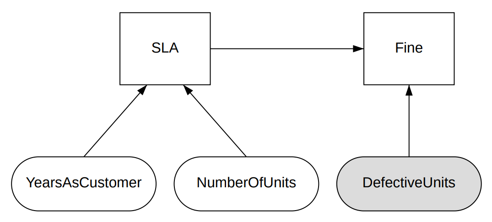

# DMN decision execution on the Cosmos blockchain

## Phase 1 - DMN model executed as a query

### Prerequisites

- In this PoC, the [dsntk](https://github.com/dsntk) engine is used as a DMN runtime.
- The example is based on the work [DMN Decision Execution on the Ethereum Blockchain](https://link.springer.com/chapter/10.1007/978-3-319-91563-0_20) by Stephan Haarmann.
- [Ignite CLI](https://docs.ignite.com/) is used to create and run the Cosmos Blockchain.
- Clone this repository locally, to be able to experiment with prepared examples.
- Install the newest stable version of Rust.
- Install the newest version of Go.
- Install the newest Ignite CLI.

### Install DSNTK

```shell
$ cargo install dsntk
$ dsntk
dsntk 0.0.3
DSNTK | Decision Toolkit
dsntk: missing subcommand
Try 'dsntk --help' for more information.
```

### Create decision table for `SLA`

The decision table for calculating `SLA` is presented below. The source is saved in file [sla.dtb](sla.dtb).
This decision table is identical to the one presented in Haarmann's work.

```text
 ┌───────┐
 │  SLA  │
 ├───┬───┴─────────────┬───────────────╥─────┐
 │ U │ YearsAsCustomer │ NumberOfUnits ║ SLA │
 │   ├─────────────────┼───────────────╫─────┤
 │   │    [0..100]     │ [0..1000000]  ║ 1,2 │
 ╞═══╪═════════════════╪═══════════════╬═════╡
 │ 1 │       <2        │    <1000      ║  1  │
 ├───┼─────────────────┼───────────────╫─────┤
 │ 2 │       <2        │   >=1000      ║  2  │
 ├───┼─────────────────┼───────────────╫─────┤
 │ 3 │      >=2        │     <500      ║  1  │
 ├───┼─────────────────┼───────────────╫─────┤
 │ 4 │      >=2        │    >=500      ║  2  │
 └───┴─────────────────┴───────────────╨─────┘
```

To evaluate this decision table, run:

```shell
$ dsntk edt sla.input sla.dtb
2
```
The [sla.input](sla.input) file contains input data presented to decision table during evaluation.

To test this decision table, run:

```shell
$ dsntk tdt sla.test sla.dtb
test 1 ... ok
test 2 ... ok
test 3 ... ok
test 4 ... ok
test 5 ... ok
test 6 ... ok
test 7 ... ok
test 8 ... ok
test 9 ... ok
test 10 ... ok
test 11 ... ok

test result: ok. 11 passed; 0 failed.
```

### Create decision table for `Fine`

The decision table for calculating `Fine` is presented below. The source is saved in file [fine.dtb](fine.dtb).
This decision table is identical to the one presented in Haarmann's work.

```text
 ┌───────┐
 │ Fine  │
 ├───┬───┴────────────┬─────╥──────┐
 │ U │ DefectiveUnits │ SLA ║ Fine │
 │   ├────────────────┼─────╫──────┤
 │   │  [0.00..1.00]  │ 1,2 ║      │
 ╞═══╪════════════════╪═════╬══════╡
 │ 1 │    < 0.05      │  1  ║ 0.00 │
 ├───┼────────────────┼─────╫──────┤
 │ 2 │  [0.05..0.10]  │  1  ║ 0.02 │
 ├───┼────────────────┼─────╫──────┤
 │ 3 │    > 0.10      │  1  ║ 1.00 │
 ├───┼────────────────┼─────╫──────┤
 │ 4 │    < 0.01      │  2  ║ 0.00 │
 ├───┼────────────────┼─────╫──────┤
 │ 5 │  [0.01..0.05]  │  2  ║ 0.05 │
 ├───┼────────────────┼─────╫──────┤
 │ 6 │    > 0.05      │  2  ║ 1.05 │
 └───┴────────────────┴─────╨──────┘
```

To evaluate this decision table, run:

```shell
$ dsntk edt fine.input fine.dtb
0.02
```
The [fine.input](fine.input) file contains input data presented to decision table during evaluation.

To test this decision table, run:

```shell
test 1 ... ok
test 2 ... ok
test 3 ... ok
test 4 ... ok
test 5 ... ok
test 6 ... ok
test 7 ... ok
test 8 ... ok
test 9 ... ok
test 10 ... ok
test 11 ... ok
test 12 ... ok

test result: ok. 12 passed; 0 failed.
```

### Create decision model for calculating `SLA` and `Fine`

Decision tables presented above contain properly working decision logic as described in Haarmann's work.
This logic must be combined in a decision model, specifying requirements and dependencies as depicted below:



Decision model is identical to the one presented in Haarmann's work.
Every decision model, to be evaluated, must be prepared in XML format, compliant with DMN specification.
The file [mancus.dmn](mancus.dmn) contains such a model. The content of this file is presented below.

```xml
<?xml version="1.0" encoding="UTF-8" standalone="yes"?>
<definitions namespace="https://dsntk.io"
             name="DecisionContract"
             id="_f78964ab-4b04-4dee-b9b0-fa3db9b2e499"
             xmlns="https://www.omg.org/spec/DMN/20191111/MODEL/"
             xmlns:di="http://www.omg.org/spec/DMN/20180521/DI/"
             xmlns:dmndi="https://www.omg.org/spec/DMN/20191111/DMNDI/"
             xmlns:dc="http://www.omg.org/spec/DMN/20180521/DC/">

    <description>
        Decision contract for calculating the _fine_.
    </description>

    <decision name="SLA" label="SLA" id="_822e095e-a12e-4de4-9468-14c059e354c3">
        <description>
            Calculates the **SLA**.
        </description>
        <variable typeRef="number" name="SLA">
            <description>
                Calculated SLA.
            </description>
        </variable>
        <informationRequirement id="_a5c2170c-8187-43f6-9a70-53ad64a8446b">
            <requiredInput href="#_32873537-d1f7-4305-9d2f-6b1b0ab91dc1"/>
        </informationRequirement>
        <informationRequirement id="_9e70e348-4e66-485d-8dc4-6a16cc65fa05">
            <requiredInput href="#_dd4cf4f2-92a4-4f97-96f3-0458c3c32d25"/>
        </informationRequirement>
        <decisionTable outputLabel="SLA">
            <input>
                <inputExpression typeRef="number">
                    <text>YearsAsCustomer</text>
                </inputExpression>
                <inputValues>
                    <text>[0..100]</text>
                </inputValues>
            </input>
            <input>
                <inputExpression typeRef="number">
                    <text>NumberOfUnits</text>
                </inputExpression>
                <inputValues>
                    <text>[0..1000000]</text>
                </inputValues>
            </input>
            <output>
                <outputValues>
                    <text>1,2</text>
                </outputValues>
            </output>
            <rule>
                <inputEntry>
                    <text>&lt; 2</text>
                </inputEntry>
                <inputEntry>
                    <text>&lt; 1000</text>
                </inputEntry>
                <outputEntry>
                    <text>1</text>
                </outputEntry>
            </rule>
            <rule>
                <inputEntry>
                    <text>&lt; 2</text>
                </inputEntry>
                <inputEntry>
                    <text>&gt;= 1000</text>
                </inputEntry>
                <outputEntry>
                    <text>2</text>
                </outputEntry>
            </rule>
            <rule>
                <inputEntry>
                    <text>&gt;= 2</text>
                </inputEntry>
                <inputEntry>
                    <text>&lt; 500</text>
                </inputEntry>
                <outputEntry>
                    <text>1</text>
                </outputEntry>
            </rule>
            <rule>
                <inputEntry>
                    <text>&gt;= 2</text>
                </inputEntry>
                <inputEntry>
                    <text>&gt;= 500</text>
                </inputEntry>
                <outputEntry>
                    <text>2</text>
                </outputEntry>
            </rule>
        </decisionTable>
    </decision>

    <decision name="Fine" label="Fine" id="_77a97976-3140-4a91-9b47-c3d3587f3065">
        <description>
            Calculates the **fine**.
        </description>
        <variable typeRef="number" name="Fine">
            <description>
                Calculated fine.
            </description>
        </variable>
        <informationRequirement id="_738f8936-85ac-4f8c-9bc2-b2e2ed9e1f80">
            <requiredInput href="#_ab93cef8-48c2-4c79-9165-12531c4a4b3f"/>
        </informationRequirement>
        <informationRequirement id="_6e20677f-f7c1-4000-9acb-b063fa35af16">
            <requiredDecision href="#_822e095e-a12e-4de4-9468-14c059e354c3"/>
        </informationRequirement>
        <decisionTable outputLabel="Fine">
            <input>
                <inputExpression typeRef="number">
                    <text>DefectiveUnits</text>
                </inputExpression>
                <inputValues>
                    <text>[0.00 .. 1.00]</text>
                </inputValues>
            </input>
            <input>
                <inputExpression typeRef="number">
                    <text>SLA</text>
                </inputExpression>
                <inputValues>
                    <text>1,2</text>
                </inputValues>
            </input>
            <output/>
            <rule>
                <inputEntry>
                    <text>&lt; 0.05</text>
                </inputEntry>
                <inputEntry>
                    <text>1</text>
                </inputEntry>
                <outputEntry>
                    <text>0</text>
                </outputEntry>
            </rule>
            <rule>
                <inputEntry>
                    <text>[0.05 .. 0.1]</text>
                </inputEntry>
                <inputEntry>
                    <text>1</text>
                </inputEntry>
                <outputEntry>
                    <text>0.02</text>
                </outputEntry>
            </rule>
            <rule>
                <inputEntry>
                    <text>&gt; 0.1</text>
                </inputEntry>
                <inputEntry>
                    <text>1</text>
                </inputEntry>
                <outputEntry>
                    <text>1</text>
                </outputEntry>
            </rule>
            <rule>
                <inputEntry>
                    <text>&lt; 0.01</text>
                </inputEntry>
                <inputEntry>
                    <text>2</text>
                </inputEntry>
                <outputEntry>
                    <text>0</text>
                </outputEntry>
            </rule>
            <rule>
                <inputEntry>
                    <text>[0.01 .. 0.05]</text>
                </inputEntry>
                <inputEntry>
                    <text>2</text>
                </inputEntry>
                <outputEntry>
                    <text>0.05</text>
                </outputEntry>
            </rule>
            <rule>
                <inputEntry>
                    <text>&gt; 0.05</text>
                </inputEntry>
                <inputEntry>
                    <text>2</text>
                </inputEntry>
                <outputEntry>
                    <text>1.05</text>
                </outputEntry>
            </rule>
        </decisionTable>
    </decision>

    <inputData name="YearsAsCustomer" label="years as customer" id="_32873537-d1f7-4305-9d2f-6b1b0ab91dc1">
        <variable typeRef="number" name="YearsAsCustomer">
            <description>
                Number of years the customer buys units from the manufacturer.
                **Value provided by the manufacturer.**
            </description>
        </variable>
    </inputData>

    <inputData name="NumberOfUnits" label="number of units" id="_dd4cf4f2-92a4-4f97-96f3-0458c3c32d25">
        <variable typeRef="number" name="NumberOfUnits">
            <description>
                Total number of units bought by the customer during whole cooperation with the manufacturer.
                **Value provided by the manufacturer.**
            </description>
        </variable>
    </inputData>

    <inputData name="DefectiveUnits" label="defective units" id="_ab93cef8-48c2-4c79-9165-12531c4a4b3f">
        <variable typeRef="number" name="DefectiveUnits">
            <description>
                Number of defective units.
                **Value provided by the customer.**
            </description>
        </variable>
    </inputData>

    <dmndi:DMNDI>
        <dmndi:DMNDiagram sharedStyle="style1">
            <dmndi:Size height="340.0" width="680.0"/>
            <dmndi:DMNShape dmnElementRef="_822e095e-a12e-4de4-9468-14c059e354c3">
                <dc:Bounds height="80.0" width="100.0" x="200.0" y="60.0"/>
            </dmndi:DMNShape>
            <dmndi:DMNShape dmnElementRef="_77a97976-3140-4a91-9b47-c3d3587f3065">
                <dc:Bounds height="80.0" width="100.0" x="470.0" y="60.0"/>
            </dmndi:DMNShape>
            <dmndi:DMNShape dmnElementRef="_32873537-d1f7-4305-9d2f-6b1b0ab91dc1">
                <dc:Bounds height="60.0" width="160.0" x="80.0" y="220.0"/>
            </dmndi:DMNShape>
            <dmndi:DMNShape dmnElementRef="_dd4cf4f2-92a4-4f97-96f3-0458c3c32d25">
                <dc:Bounds height="60.0" width="160.0" x="260.0" y="220.0"/>
            </dmndi:DMNShape>
            <dmndi:DMNShape dmnElementRef="_ab93cef8-48c2-4c79-9165-12531c4a4b3f" sharedStyle="style2">
                <dc:Bounds height="60.0" width="160.0" x="440.0" y="220.0"/>
            </dmndi:DMNShape>
            <dmndi:DMNEdge dmnElementRef="_a5c2170c-8187-43f6-9a70-53ad64a8446b">
                <di:waypoint x="160.0" y="220.0"/>
                <di:waypoint x="230.0" y="140.0"/>
            </dmndi:DMNEdge>
            <dmndi:DMNEdge dmnElementRef="_9e70e348-4e66-485d-8dc4-6a16cc65fa05">
                <di:waypoint x="340.0" y="220.0"/>
                <di:waypoint x="270.0" y="140.0"/>
            </dmndi:DMNEdge>
            <dmndi:DMNEdge dmnElementRef="_738f8936-85ac-4f8c-9bc2-b2e2ed9e1f80">
                <di:waypoint x="520.0" y="220.0"/>
                <di:waypoint x="520.0" y="140.0"/>
            </dmndi:DMNEdge>
            <dmndi:DMNEdge dmnElementRef="_6e20677f-f7c1-4000-9acb-b063fa35af16">
                <di:waypoint x="300.0" y="100.0"/>
                <di:waypoint x="470.0" y="100.0"/>
            </dmndi:DMNEdge>
        </dmndi:DMNDiagram>
        <dmndi:DMNStyle id="style1" fontSize="12"/>
        <dmndi:DMNStyle id="style2">
            <dmndi:FillColor red="220" green="220" blue="220"/>
        </dmndi:DMNStyle>
    </dmndi:DMNDI>
</definitions>
```

### Execute the decision model

To execute the decision model using DSNTK, run:

```shell
$ dsntk srv -v
Found 1 model.
Loaded 1 model.
Deployed 2 invocables.

Deployed invocables:
  io/dsntk/DecisionContract/Fine
  io/dsntk/DecisionContract/SLA

dsntk 0.0.0.0:22022
```

DSNTK, run with command `srv` searches for DMN models in current directory. While there is exactly one in file
[mancus.dmn](mancus.dmn), DSNTK loads the model and deploys invocables (decision tables in our case) and prepares
JSON API endpoints to evaluate those invocables.

To test `SLA` decision, open another terminal and run:

```shell
$ curl -s \
       -d "{ YearsAsCustomer: 1, NumberOfUnits: 1000 }" \
       -H "Content-Type: application/json" \
       -X POST http://0.0.0.0:22022/evaluate/io/dsntk/DecisionContract/SLA
{"data":2}
```
The result `SLA` is **2**.

To test `Fine` decision, run:

```shell
$ curl -s \
       -d "{ YearsAsCustomer: 1, NumberOfUnits: 1000, DefectiveUnits: 0.034 }" \
       -H "Content-Type: application/json" \
       -X POST http://0.0.0.0:22022/evaluate/io/dsntk/DecisionContract/Fine
{"data":0.05}       
```
The result `Fine` is 0.05 that is **5%**.

To run both tests shown above:

```shell
$ chmod +x mancus.sh
$ ./mancus.sh
Calculating SLA:
{"data":2}
Calculating fine:
{"data":0.05}
```

> Now we have the DMN decision model up and running. This model can be evaluated by executing two JSON API endpoints using `curl`:
> - http://0.0.0.0:22022/evaluate/io/dsntk/DecisionContract/SLA
> - http://0.0.0.0:22022/evaluate/io/dsntk/DecisionContract/Fine

### Create Go client to invoke the decision model

The example Go application that evaluates decision model is prepared in file [client/main.go](client/main.go).
The source is presented below:

```Go
package main

import (
	"bytes"
	"encoding/json"
	"fmt"
	"net/http"
)

const Uri = "http://0.0.0.0:22022/evaluate/io/dsntk/DecisionContract/"
const SlaUri = Uri + "SLA"
const FineUri = Uri + "Fine"
const ContentType = "application/json"

type SlaParams struct {
	YearsAsCustomer int64 `json:"YearsAsCustomer"`
	NumberOfUnits   int64 `json:"NumberOfUnits"`
}

type SlaResult struct {
	Data int64 `json:"data"`
}

type FineParams struct {
	YearsAsCustomer int64   `json:"YearsAsCustomer"`
	NumberOfUnits   int64   `json:"NumberOfUnits"`
	DefectiveUnits  float64 `json:"DefectiveUnits"`
}

type FineResult struct {
	Data float64 `json:"data"`
}

func querySla(yearsAsCustomer int64, numberOfUnits int64) int64 {
	slaParams := SlaParams{
		YearsAsCustomer: yearsAsCustomer,
		NumberOfUnits:   numberOfUnits,
	}

	var body bytes.Buffer
	err := json.NewEncoder(&body).Encode(&slaParams)
	if err != nil {
		panic(err)
	}

	response, err := http.Post(SlaUri, ContentType, &body)
	if err != nil {
		panic(err)
	}

	slaResult := SlaResult{}
	err = json.NewDecoder(response.Body).Decode(&slaResult)
	if err != nil {
		panic(err)
	}
	return slaResult.Data
}

func queryFine(yearsAsCustomer int64, numberOfUnits int64, defectiveUnits float64) float64 {
	fineParams := FineParams{
		YearsAsCustomer: yearsAsCustomer,
		NumberOfUnits:   numberOfUnits,
		DefectiveUnits:  defectiveUnits,
	}

	var body bytes.Buffer
	err := json.NewEncoder(&body).Encode(&fineParams)
	if err != nil {
		panic(err)
	}

	response, err := http.Post(FineUri, ContentType, &body)
	if err != nil {
		panic(err)
	}

	fineResult := FineResult{}
	err = json.NewDecoder(response.Body).Decode(&fineResult)
	if err != nil {
		panic(err)
	}
	return fineResult.Data
}

func main() {
	fmt.Printf("SLA = %d\n", querySla(1, 1000))
	fmt.Printf("Fine = %.0f%%\n", queryFine(1, 1000, 0.034)*100)
}
```

To test this application, run:

```shell
$ cd client
$ go run dsntk/client
SLA = 2
Fine = 5%
```
NOTE: The DSNTK server must be running with decision model deployed, but this is obvious ;-)

> Now we have the DMN decision model up and running. this model can be executed from Go application.
> We will use this Go code to implement query in Cosmos blockchain.

### Create example blockchain named `decon`

Check ignite version:

```shell
$ ignite ignite version
Ignite CLI version:             v28.1.1
Cosmos SDK version:             v0.50.3
Your OS:                        linux
Your arch:                      amd64
Your Node.js version:           v20.10.0
Your go version:                go version go1.21.6 linux/amd64
Is on Gitpod:                   false 
```

Create a chain:

```shell
$ ignite scaffold chain decon
```

## Phase 2 - ?
(tbd)

## Phase 3 - ?
(tbd)

## Phase 4 - ?
(tbd)

## Phase 5 - ?
(tbd)
